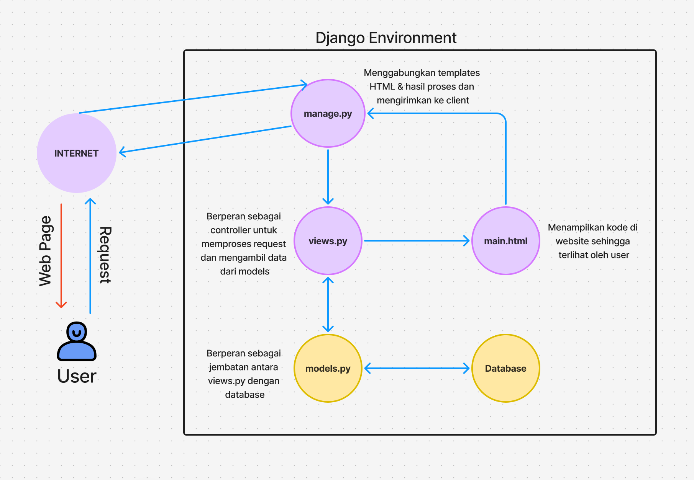

<h1><b>HI! Welcome to Toko Messi Indah🤩😎</b></h1>

    <h2>
    1. Jelaskan bagaimana cara kamu mengimplementasikan checklist di atas secara step-by-step!</h2>
    

    <ul>
        <li>
            Pertama, saya membuat folder di repositori lokal untuk menyimpan proyek ini. 
        </li>
        <li>
            Selanjutnya, saya membuat repositori baru di github saya. 
        </li>
        <li>
            Lalu, saya menginisiasikan git di repositori lokal dengan <i>command</i> "git init" dan menghubungkan repositori lokal dengan repositori di Github dengan <i>command</i> "git remote add origin [link repo Github saya]". 
        </li>
        <li>
            Saya membuat branch untuk membedakan master dengan development environment agar menjaga kode saya. Saya mengerjakannya di branch development terlebih dahulu. 
            <i>Step</i> ini opsional.
        </li>
        <li>
            Next stepnya adalah membuat virtual environment. Di terminal, saya menginisiasi virtual environment dengan <i>command</i> "python -m venv env" dan mengaktifkannya dengan <i>command</i> "env\Scripts\activate". 
        </li>
        <li>
            Lalu, saya melakukan instalasi dependencies sesuai dengan yang di tutorial. Karena saya berencana untuk menambahkan gambar di toko saya, saya juga menginstall Pillow.
        </li>
        <li>
            Selanjutnya, saya membuat proyek Django dengan <i>command</i> "django-admin startproject toko-messi-indah".
        </li>
        <li>
            Saya membuat aplikasi baru bernama main dengan menggunakan <i>command</i> "python manage.py startapp main". 
        </li>
        <li>
            Next, saya ke file settings.py dan menambahkan "localhost", dan "127.0.0.1" di bagian ALLOWED_HOSTS. Lalu saya menambahkan "main" di bagian INSTALLED_APPS.
        </li>
        <li>
            Habis itu, saya membuat folder "templates" di dalam main. Saya juga membuat file "main.html" di dalam folder templates yang baru dibuat dan mengisinya dengan konten yang ingin ditampilkan di website.
        </li>
        <li>
            Selanjutnya saya mengubah models dalam file models.py. Saya membuat model name, price, description, category, dan image. 
        </li>
        <li>
            Saya membuat dan mengaplikasikan migrasi model dengan <i>command</i> "python manage.py makemigrations" dan "python manage.py migrate".
        </li>
        <li>
            Lalu, saya mengedit file views.py untuk menghubungkan komponen template dengan komponen view.
        </li>
        <li>
            Saya melakukan konfigurasi routing URL dengan membuat file urls.py dalam direktori main. Saya mengisi file tersebut dengan kode sesuai dengan tutorial. Lalu, saya membuka file urls.py DI DIREKTORI PROYEK (bukan main) dan mengimport fungsi include. Saya juga menambahkan rute URL dalam urlpatterns untuk mengarahkan ke tampilan main.
        </li>
        <li>
            Saya git add, git commit, dan akhirnya git push ke repo master saya untuk menyimpan semua perubahan.
        </li>
        <li>
            Saya membuat proyek baru di PWS dan push proyek toko yang sudah saya buat ke PWS tersebut.
        </li>
    </ul>
    

    <h2 align="justify">
    2. Buatlah bagan yang berisi request client ke web aplikasi berbasis Django beserta responnya dan jelaskan pada bagan tersebut kaitan antara <i>urls.py, views.py, models.py, dan berkas html</i>.
    </h2>
    

    <h2>3. Jelaskan fungsi git dalam pengembangan perangkat lunak!</h2>
    

    Git digunakan sebagai control untuk pengembangan perangkat lunak. Git memudahkan developers untuk bekerja sama menggunakan branch masing-masing sehingga branch utama aman dari error apabila sebuah developer melakukan kesalahan. Lalu, Git juga digunakan untuk menyimpan versi kode dari proyek sehingga developer bisa melihat kembali <i>progress</i> yang telah dibuat. Git (melalui Github) bisa mendukung proses testing melalui CI/CD.
    

    <h2 align="justify">
    4. Menurut Anda, dari semua framework yang ada, mengapa framework Django dijadikan permulaan pembelajaran pengembangan perangkat lunak?</h2>
    

    Menurut saya, framework Django dijadikan permulaan pembelajaran pengembangan perangkat lunak karena menggunakan bahasa python yang syntaxnya lumayan mudah untuk dipahami dan <i>beginner friendly</i>. Lalu, komunitas yang besar memudahkan troubleshooting dan versi yang up-to-date karena banyak developer menggunakan framework ini. Alasan terakhir adalah karena Django memudahkan pemahaman pengembangan front-end dan back-end, pengelolaan database, URL routing, dan testing.
    

    <h2>5. Mengapa model pada Django disebut sebagai ORM?</h2>
    

    Model Django disebut sebagai ORM karena menghubungkan dan mengelola data di basis data dengan cara yang lebih intuitif dan berorientasi objek. Dalam Django, data disimpan dalam bentuk tabel yang terhubung ke satu sama lain. Django juga memungkinkan CRUD dengan beberapa instruksi.
    

<h2>THE END🙏</h2>
