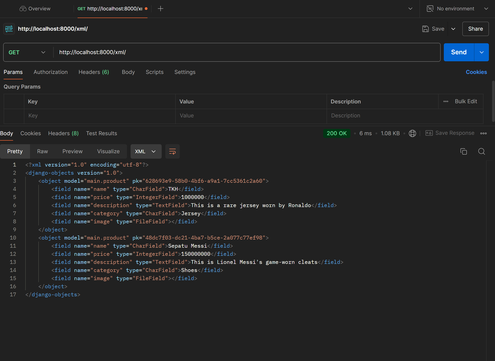
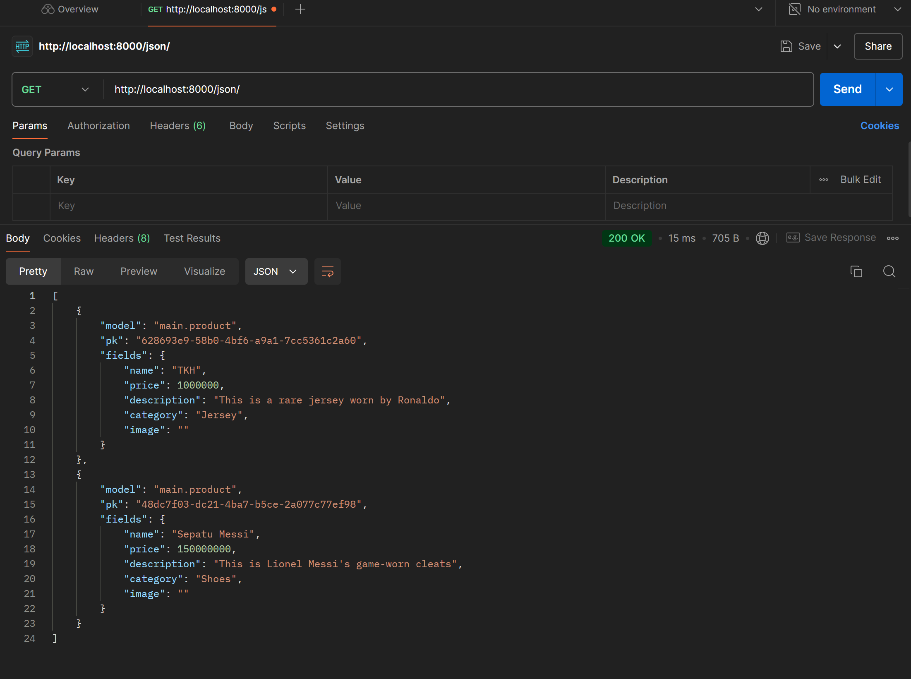
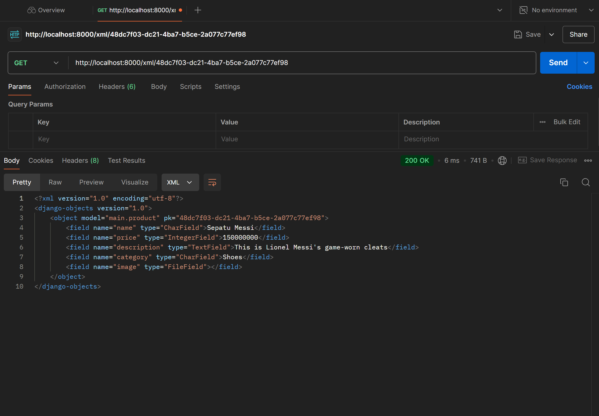
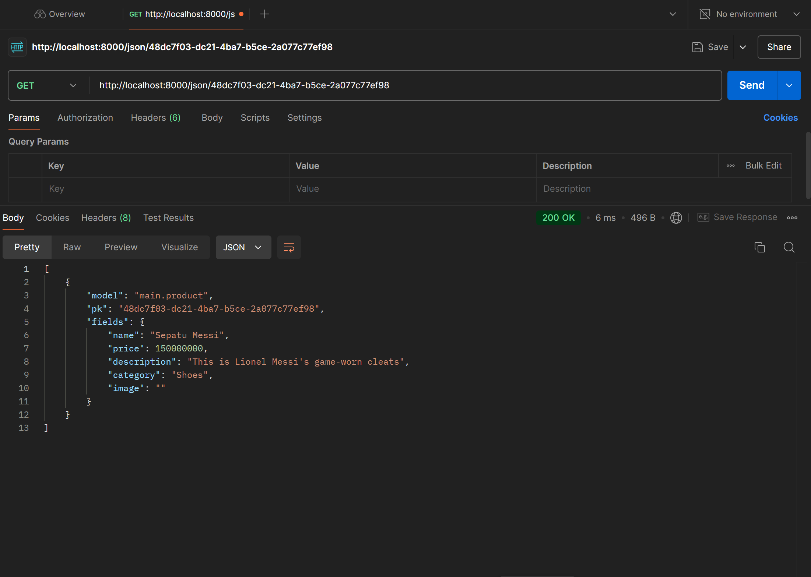

<h1><b>HI! Welcome to Toko Messi Indah🤩😎</b></h1>

    
Tugas Sebelumnya

    

        
Tugas 2

            

                <h2>
                1. Jelaskan bagaimana cara kamu mengimplementasikan checklist di atas secara step-by-step!</h2>
                

                <ul>
                    <li>
                        Pertama, saya membuat folder di repositori lokal untuk menyimpan proyek ini. 
                    </li>
                    <li>
                        Selanjutnya, saya membuat repositori baru di github saya. 
                    </li>
                    <li>
                        Lalu, saya menginisiasikan git di repositori lokal dengan <i>command</i> "git init" dan menghubungkan repositori lokal dengan repositori di Github dengan <i>command</i> "git remote add origin [link repo Github saya]". 
                    </li>
                    <li>
                        Saya membuat branch untuk membedakan master dengan development environment agar menjaga kode saya. Saya mengerjakannya di branch development terlebih dahulu. 
                        <i>Step</i> ini opsional.
                    </li>
                    <li>
                        Next stepnya adalah membuat virtual environment. Di terminal, saya menginisiasi virtual environment dengan <i>command</i> "python -m venv env" dan mengaktifkannya dengan <i>command</i> "env\Scripts\activate". 
                    </li>
                    <li>
                        Lalu, saya melakukan instalasi dependencies sesuai dengan yang di tutorial. Karena saya berencana untuk menambahkan gambar di toko saya, saya juga menginstall Pillow.
                    </li>
                    <li>
                        Selanjutnya, saya membuat proyek Django dengan <i>command</i> "django-admin startproject toko-messi-indah".
                    </li>
                    <li>
                        Saya membuat aplikasi baru bernama main dengan menggunakan <i>command</i> "python manage.py startapp main". 
                    </li>
                    <li>
                        Next, saya ke file settings.py dan menambahkan "localhost", dan "127.0.0.1" di bagian ALLOWED_HOSTS. Lalu saya menambahkan "main" di bagian INSTALLED_APPS.
                    </li>
                    <li>
                        Habis itu, saya membuat folder "templates" di dalam main. Saya juga membuat file "main.html" di dalam folder templates yang baru dibuat dan mengisinya dengan konten yang ingin ditampilkan di website.
                    </li>
                    <li>
                        Selanjutnya saya mengubah models dalam file models.py. Saya membuat model name, price, description, category, dan image. 
                    </li>
                    <li>
                        Saya membuat dan mengaplikasikan migrasi model dengan <i>command</i> "python manage.py makemigrations" dan "python manage.py migrate".
                    </li>
                    <li>
                        Lalu, saya mengedit file views.py untuk menghubungkan komponen template dengan komponen view.
                    </li>
                    <li>
                        Saya melakukan konfigurasi routing URL dengan membuat file urls.py dalam direktori main. Saya mengisi file tersebut dengan kode sesuai dengan tutorial. Lalu, saya membuka file urls.py DI DIREKTORI PROYEK (bukan main) dan mengimport fungsi include. Saya juga menambahkan rute URL dalam urlpatterns untuk mengarahkan ke tampilan main.
                    </li>
                    <li>
                        Saya git add, git commit, dan akhirnya git push ke repo master saya untuk menyimpan semua perubahan.
                    </li>
                    <li>
                        Saya membuat proyek baru di PWS dan push proyek toko yang sudah saya buat ke PWS tersebut.
                    </li>
                </ul>
                

            

            

                <h2 align="justify">
                2. Buatlah bagan yang berisi request client ke web aplikasi berbasis Django beserta responnya dan jelaskan pada bagan tersebut kaitan antara <i>urls.py, views.py, models.py, dan berkas html</i>.
                </h2>
                
            

            

                <h2>3. Jelaskan fungsi git dalam pengembangan perangkat lunak!</h2>
                

                Git digunakan sebagai control untuk pengembangan perangkat lunak. Git memudahkan developers untuk bekerja sama menggunakan branch masing-masing sehingga branch utama aman dari error apabila sebuah developer melakukan kesalahan. Lalu, Git juga digunakan untuk menyimpan versi kode dari proyek sehingga developer bisa melihat kembali <i>progress</i> yang telah dibuat. Git (melalui Github) bisa mendukung proses testing melalui CI/CD.
                

            

            

                <h2 align="justify">
                4. Menurut Anda, dari semua framework yang ada, mengapa framework Django dijadikan permulaan pembelajaran pengembangan perangkat lunak?</h2>
                

                Menurut saya, framework Django dijadikan permulaan pembelajaran pengembangan perangkat lunak karena menggunakan bahasa python yang syntaxnya lumayan mudah untuk dipahami dan <i>beginner friendly</i>. Lalu, komunitas yang besar memudahkan troubleshooting dan versi yang up-to-date karena banyak developer menggunakan framework ini. Alasan terakhir adalah karena Django memudahkan pemahaman pengembangan front-end dan back-end, pengelolaan database, URL routing, dan testing.
                

            

            

                <h2>5. Mengapa model pada Django disebut sebagai ORM?</h2>
                

                Model Django disebut sebagai ORM karena menghubungkan dan mengelola data di basis data dengan cara yang lebih intuitif dan berorientasi objek. Dalam Django, data disimpan dalam bentuk tabel yang terhubung ke satu sama lain. Django juga memungkinkan CRUD dengan beberapa instruksi.
                

            

        

    

    

        <h2> 1. Jelaskan mengapa kita memerlukan data delivery dalam pengimplementasian sebuah platform?
        </h2>
        

        Data delivery sangat diperlukan karena melalui hal tersebut para user dapat mendapatkan informasi/data <i>real-time</i>. Data delivery menjadi sebuah sarana untuk komunikasi antara database, server, dan juga tampilan page yang akan dilihat oleh user.
        

    

    

        <h2> 2.  Menurutmu, mana yang lebih baik antara XML dan JSON? Mengapa JSON lebih populer dibandingkan XML?
        </h2>
        

        Menurut saya, JSON lebih baik dibandingkan XML karena lebih cepat dan memiliki struktur yang sederhana dan gampang untuk dipahami. Tapi, setelah saya mencari tahu lebih dalam lagi, ternyata XML bisa <i>support</i> data yang lebih rumit. JSON juga lebih populer karena menurut saya lebih enak untuk dibaca. Tampilannya yang ringkas dan sudah terstruktur sangat memudahkan saya ketika membuat tugas ini.
        

    

    

        <h2>3. Jelaskan fungsi dari method is_valid() pada form Django dan mengapa kita membutuhkan method tersebut?
        </h2>
        

        Fungsi dari method is_valid() pada form Django adalah untuk memvalidasi input dari user berdasarkan parameters dan ketentuan yang sudah diprogram sebelumnya. Ini sangat dibutuhkan karena akan mengecek kebenaran data dan juga untuk <i>error handling</i> sebelum disimpan. Fungsi ini juga dibutuhkan karena dapat memastikan keamaan program dari serangan siber.
        

    

    

        <h2>4. Mengapa kita membutuhkan csrf_token saat membuat form di Django? Apa yang dapat terjadi jika kita tidak menambahkan csrf_token pada form Django? Bagaimana hal tersebut dapat dimanfaatkan oleh penyerang?
        </h2>
        

        Kita membutuhkan csrf_token saat membuat form karena akan mengenerate token ID random yang meningkatkan keamanan. Kalau tidak menggunakan csrf_token, default ID dari objek bermulai dari 1 dan akan bertambah secara inkremental untuk setiap objek tambahan. Tanpa penggunaan csrf_token, website jadi rentan terhadapa serangan CSRF (Cross-Site Request Forgery) yang memungkinkan pembuatan request yang berbahaya dari webpage palsu.
        

    

    

        <h2>Jelaskan bagaimana cara kamu mengimplementasikan checklist di atas secara step-by-step (bukan hanya sekadar mengikuti tutorial).
        </h2>
        

            <ul>
                <li align="justify">
                Saya membuat file baru di direktori templates bernama "base.html". File HTML ini akan berfungsi sebagai kerangka yang akan diextend oleh halaman lain dalam projek.
                </li>
                <li align="justify">
                Saya mengubah DIRS di bagian TEMPLATES dalam file settings.py untuk menambahkan file "base.html" yang tadi sudah saya buat agar dianggap sebagai templates.
                </li>
                <li align="justify">
                Di file models.py, saya mengimport uuid dan membuat fields baru bernama id. ID diisi dengan menggunakan <i>command</i> "models.UUIDField(primary_key=True, default=uuid.uuid4, editable=False)".
                </li>
                <li align="justify">
                Lalu, saya melakukan <i>migrations</i> dengan <i>command</i> "python manage.py makemigrations" dan "python manage.py migrate".
                </li>
                <li align="justify">
                Saya membuat file baru bernama forms.py untuk forms website saya. Di dalam file ini, saya membuat class bernama "ProductForm" yang menerima argumen ModelForm. Dalam class ini, saya membuat model yang akan berisi Product dan fields yang berisi fields yang akan ditanyakan dalam forms (di website saya adalah nama, harga, deskripsi, dan kategori).
                </li>
                <li align="justify">
                Next, di file views.py saya menambahkan import render, import ProductForm, dan juga import Product yang sudah dibuat sebelumnya.
                </li>
                <li align="justify">
                Masih dalam file views.py, saya membuat fungsi baru bernama create_product. Fungsi ini akan membuat form yang dapat menambahkan data Product secara otomatis ketika data disubmit dari form.
                </li>
                <li align="justify">
                Saya ke fungsi show_main dan menambahkan fields baru pernama "product_entries" yang akan berisi product_entries. Saya juga membuat variable product_entries yang diisi dengan <i>command</i> "Product.objects.all()".
                </li>
                <li align="justify">
                Lalu saya mengimport fungsi create_product yang tadi saya buat ke dalam file urls.py dalam direktori main.
                </li>
                <li align="justify">
                Di urlpatterns, saya membuat path baru dengan <i>command</i> "path('create-product', create_product, name='create_product')".
                </li>
                <li align="justify">
                Selanjutnya, saya membuat file baru bernama create_product.html di dalam folder templates. File ini akan mengextend base.html dan berisi csrf token, menampilkan fields form yang sudah dibuat dalam bentuk table, dan juga membuat button untuk submit request form tersebut.
                </li>
                <li align="justify">
                Saya membuat hal yang ingin saya tampilkan di website dalam file main.html. Saya memanggil fields dalam models.py.
                </li>
                <li align="justify">
                Dalam views.py, saya mengimport HttpResponse dan serializers.
                </li>
                <li align="justify">
                Dalam views.py, saya membuat 4 fungsi baru untuk mengembalikan data dalam bentuk XML, JSON, XML by ID, dan juga JSON by ID.
                </li>
                <li align="justify">
                Saya pergi ke file urls.py untuk melakukan routing url. Pertama, saya mengimport 4 fungsi yang tadi saya buat. Lalu, saya membuat 4 path baru di urlpatterns agar dapat mengakses fungsi tersebut.
                </li>
                <li align="justify">
                OK ALL DONE! Saya melakukan git add, commit, dan push. Saya juga melakukan push ke PWS.
                </li>
            </ul>
    

    

        <h2>POSTMAN XML</h2>
        
    

    

        <h2>POSTMAN JSON</h2>
        
    

    

        <h2>POSTMAN XML by ID</h2>
        
    

    

        <h2>POSTMAN JSON by ID</h2>
        
    

<h2>THE END🙏</h2>
